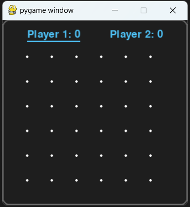

# 🎮 Dot and Boxes Game 🎮 

##  📜 Description
Dot and Boxes is a classic pen-and-paper game where two players take turns connecting dots to form lines. When a player completes a box by forming the fourth side, they score a point and get another turn. The player with the most boxes at the end of the game wins.
<br>
<br>


## ✨ Features 
- **Grid-based Gameplay:** The game consists of a grid where players take turns to draw lines between dots.
<br>

- **Two Players:** The game supports two players, either two human players taking turns.
<br>

- **Turn-based System:** The game alternates turns between the players unless a player completes a box, in which case they get an extra turn.
<br>

- **Score Tracking:** Keep track of each player's score throughout the game.
<br>


## 🎲 Instructions for Playing
1. Player 1 is represented by 'X' and Player 2 is represented by 'O'.

2. Use the arrow keys to draw lines:

   1. Up Arrow: Draw the top line of the selected cell.
   
   2. Right Arrow: Draw the right line of the selected cell.
   3. Down Arrow: Draw the bottom line of the selected cell.
   4. Left Arrow: Draw the left line of the selected cell.

   or you can also use the mouse to select cells by clicking on them.


3. When a player completes the fourth side of a box, they earn a point and get an additional turn.

4. The game ends when all the boxes are completed. "Game Over" message will be displayed

5. Press the 'R' key to restart the game at any time.

6. Press 'Q' or the 'Escape' key to quit the game.

## 💻 Installation 
1. Clone the repository to your local machine:
   ```bash
   git clone https://github.com/shrawani21/gamer_21.git
   ```
2. Navigate to the project directory:
   ```bash
   cd gamer_21
   ```
3. Install dependencies/requirements:
   ```bash
   pip install -r requirements.txt
   ```
   or
   ```bash
   pip install pygame
   ```
4. Run the Game:
   ```bash
   python main.py
   ```
   This will launch the game!


## 🤝 How to Contribute

If you think that you can add a new feature or want to fix a bug, we invite you to contribute to gamer_21 and make this project better. 
<br>To start contributing, follow the below instructions:

1.  Create a folder in your system where you want to save the files.

2.   Open Git Bash there.

3.  Create a Git repository.
            Run command  `git init`
            
4.  Fork the  [repository](https://github.com/shrawani21/gamer_21.git).

5.  Clone your forked repository of project.
```
git clone https://github.com/<your_username>/gamer_21.git
```

6.  Navigate to the project directory.

```
cd gamer_21
```
7.  Add a reference(remote) to the original repository.

```
git remote add upstream https://github.com/shrawani21/gamer_21.git
```
8.  Check the remotes for this repository.

```
git remote -v
```

9.  Always take a pull from the upstream repository to your main branch to keep it updated as per the main project repository.

```
git pull upstream main
```

10.  Create a new branch(prefer a branch name that relates to your assigned issue).

```
git checkout -b <YOUR_BRANCH_NAME>
```

11.  Perform your desired changes to the code base.
    
12.  Check your changes.
    

```
git status
```

```
git  diff
```

13.  Stage your changes.

```
git add . <\files_that_you_made_changes>
```

14.  Commit your changes.

```
git commit -m "relavant message"
```

15.  Push the committed changes in your feature branch to your remote repository.

```
git push -u origin <your_branch_name>
```

16.  To create a pull request, click on  `compare and pull requests`.
    
17.  Add an appropriate title and description to your pull request explaining your changes.
    
18.  Click on  `Create pull request`.
    

Congratulations🎉, you have made a pull request to the Gamer_21. Wait for your submission to be accepted and merged.

## Tech Stacks Used:
-python 
-pygame

## 📜 Credits 
- This project is based on the classic Dot and Boxes game.
- Developed using Python only.


## 📄 License 
- This project is licensed under the [MIT License](https://opensource.org/licenses/MIT).
